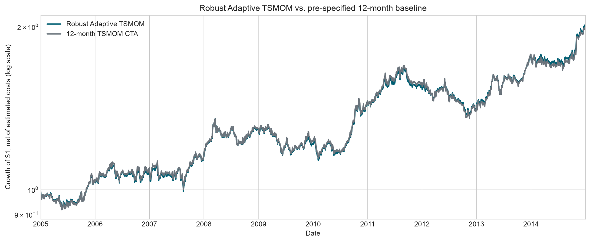

# DELTA1 Quant Research

NUS Investment Society Quant Research submission: an explainable, cost-aware trend-following strategy across 22 global futures.

The research question is simple: **can a literature-backed 12-month time-series momentum signal be improved with transparent volatility and execution controls, and do machine-learning features add genuine out-of-sample value?**



## Result

All reported results are net of a half-tick spread estimate plus USD 2.50 per contract per one-way trade. The evaluation covers ten calendar years, from 2005-01-03 through 2014-12-31.

| Strategy | CAGR | Volatility | Sharpe | Max drawdown | Annual cost drag |
|---|---:|---:|---:|---:|---:|
| Adaptive TSMOM | 7.04% | 10.56% | 0.70 | -18.61% | 0.12% |
| 12-month TSMOM | 6.93% | 10.69% | 0.68 | -20.19% | 0.14% |
| 50% ML / 50% trend | 5.36% | 10.80% | 0.54 | -18.22% | 0.15% |
| ML only | 1.03% | 10.49% | 0.15 | -19.19% | 0.18% |

The recommended strategy is **Adaptive TSMOM**. Its improvement over the baseline is modest and not statistically decisive; its value is implementation discipline rather than a claim of new alpha. The ML classifier has 0.491 out-of-sample ROC AUC and is rejected. Reporting that negative result avoids selecting a more complicated model simply because it was tried.

## Method

At each month-end, contract `i` receives the forecast:

```text
direction[i, t] = sign(close[i, t] - close[i, t - 252])
```

The portfolio then:

1. estimates contract risk from lagged exponentially weighted price-change volatility;
2. allocates equal ex-ante risk to equity indices, bonds, G10 FX, and commodities;
3. tapers exposure when 20-day volatility rises far above 120-day volatility;
4. targets 10% annualized portfolio volatility with a 2x leverage cap;
5. suppresses small month-end changes using a 25% no-trade region;
6. activates new targets on the next business day;
7. calculates futures P&L from price change × point value and deducts contract-specific costs.

Price changes—not percentage returns—are used because the supplied `_CCB` series are additive back-adjusted continuous futures whose synthetic levels can approach or cross zero.

## Universe

| Asset class | Contracts |
|---|---|
| Equity indices | ES, NQ, RTY, NKD |
| US government bonds | ZT, ZF, ZN, ZB |
| G10 FX | 6A, 6B, 6C, 6E, 6J, 6S |
| Commodities | CL, NG, GC, SI, HG, ZC, ZW, ZS |

## Machine-learning robustness test

The pooled monthly classifier uses trend, breakout, volatility, skew, cross-sectional rank, asset-class context, and lagged public macro features. Each January, a trailing 24-month validation window selects among two ridge-logistic and two shallow gradient-boosting models. Only labels ending before the prediction year are eligible.

The macro inputs are downloaded from FRED and lagged one business day:

- [VIXCLS](https://fred.stlouisfed.org/series/VIXCLS)
- [T10Y2Y](https://fred.stlouisfed.org/series/T10Y2Y)
- [BAA10Y](https://fred.stlouisfed.org/series/BAA10Y)

The ML model underperforms in both classification and portfolio terms. It remains in the repository as a leakage-safe falsification exercise.

## Repository

```text
DELTA1_Quant_Research.ipynb   executed submission notebook
delta1_cta.py                 data, accounting, sizing, baseline and metrics
institutional_strategy.py    adaptive risk and no-trade controls
ml_strategy.py               nested walk-forward ML experiment
download_external_data.py    reproducible FRED download and source hashes
tests/                        timing, leakage, bounds, costs and integration tests
outputs/                      headline metrics, stress tables and charts
```

## Reproduce

Python 3.11 or newer is recommended.

```bash
git clone git@github.com:Manutd1234/Delta1_Trading_Strategy.git
cd Delta1_Trading_Strategy

python -m venv .venv
source .venv/bin/activate
pip install -e ".[notebook]"

export DELTA1_DATA_DIR="/path/to/Round1AllData/Quant Researcher/Delta1"
```

Run the recommended strategy:

```bash
python institutional_strategy.py \
  --data-dir "$DELTA1_DATA_DIR" \
  --output-dir outputs
```

Reproduce the ML robustness test:

```bash
python download_external_data.py
python ml_strategy.py \
  --data-dir "$DELTA1_DATA_DIR" \
  --external-macro data/external/fred_macro.csv \
  --output-dir outputs
```

Run tests and execute the notebook:

```bash
python -m unittest discover -s tests -v
jupyter nbconvert --to notebook --execute --inplace \
  DELTA1_Quant_Research.ipynb
```

## Research basis

- Moskowitz, Ooi & Pedersen, [“Time Series Momentum”](https://pages.stern.nyu.edu/~lpederse/papers/TimeSeriesMomentum.pdf), *Journal of Financial Economics* (2012).
- Hurst, Ooi & Pedersen, [“A Century of Evidence on Trend-Following Investing”](https://doi.org/10.3905/jpm.2017.44.1.015), *Journal of Portfolio Management* (2017).
- Moreira & Muir, [“Volatility-Managed Portfolios”](https://www.nber.org/papers/w22208), *Journal of Finance* (2017).
- Gu, Kelly & Xiu, [“Empirical Asset Pricing via Machine Learning”](https://www.nber.org/papers/w25398), *Review of Financial Studies* (2020).
- Bailey et al., [“The Probability of Backtest Overfitting”](https://papers.ssrn.com/sol3/papers.cfm?abstract_id=2326253), *Journal of Computational Finance* (2017).

## Limitations

- The supplied data end in 2014; post-2014 locked-holdout validation is required.
- Continuous contracts hide actual rolls and are not directly tradable.
- The cost model omits market impact, exchange fees, liquidity regimes, margin, and collateral return.
- Fractional positions omit integer-contract and capital constraints.
- The fixed catalogue may introduce survivorship bias.
- Historical FRED downloads may contain revisions; vintage releases are preferable.

Historical research only; not investment advice. MIT licensed.
