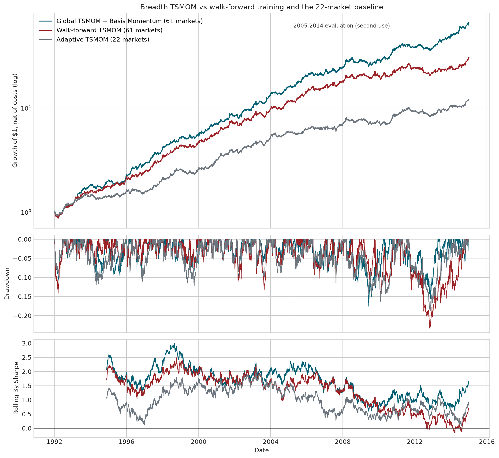

# DELTA1 Quant Research

NUS Investment Society Quant Research submission: an explainable, cost-aware **two-sleeve CTA across 43 global futures markets**, built under a pre-registered protocol with a walk-forward training experiment, an audit of four institutional risk-engineering fixes, and two alpha searches spanning eighteen candidate return sources.

The research question: **does widening the traded universe raise CAGR and Sharpe; does data-driven model selection ("training") add anything; and is there a second return source that genuinely diversifies trend rather than restating it?**



## Result

All results are net of a half-tick spread estimate plus USD 2.50 per contract per one-way trade, at a 10% volatility target. The data end 2014-12-31; v1 already reported the 2005–2014 window, so it is labeled a *second use*, and 1990–2004 is the primary evidence window (see [PREREGISTRATION.md](PREREGISTRATION.md)).

| Strategy | Window | CAGR | Sharpe | Max drawdown |
|---|---|---:|---:|---:|
| **Trend + Basis Momentum (43 markets)** | 1990–2004 | **20.5%** | **1.73** | −15.8% |
| Trend sleeve only (43 markets) | 1990–2004 | 18.4% | 1.59 | −11.9% |
| Adaptive TSMOM (22 markets, v1) | 1990–2004 | 13.7% | 1.27 | −12.2% |
| **Trend + Basis Momentum (43 markets)** | 2005–2014 | **13.2%** | **1.17** | **−15.3%** |
| Trend sleeve only (43 markets) | 2005–2014 | 11.0% | 0.99 | −20.8% |
| Adaptive TSMOM (22 markets, v1) | 2005–2014 | 7.0% | 0.70 | −18.6% |
| Walk-forward selection (training) | 2005–2014 | 7.4% | 0.70 | −24.2% |
| Ensemble of 5 trend candidates | 2005–2014 | 9.0% | 0.81 | −23.9% |

Against the v1 baseline the 90% paired-bootstrap interval of the Sharpe difference now **excludes zero in both windows** (+0.326 primary, +0.385 second-use), with 8 of 10 winning evaluation years, PSR 0.89/0.90 and a deflated Sharpe of 0.97–1.00 against an honest count of 74 trials. The mechanism is measured, not asserted: effective independent bets rise from 8.8 (baseline) to 12.3 (breadth) to **14.0** (two sleeves), and Sharpe scales with their square root. It survives 3× costs, 5× costs on the six thinnest markets, dropping any single asset class, and excluding 2008–09 (Sharpe 1.21 without the crisis).

**A second search under stricter validation: ten more papers, none adopted.** Round 1 selected on the whole primary window and only checked replication on the reporting window — which is how a specification bug survived to the final stage. Round 2 split the primary window itself into **discovery (1990–1997)** and **confirmation (1998–2004)**, so a candidate must replicate independently before the reporting window is ever opened, and promoted drawdown to a first-class adoption criterion. Ten more papers were implemented faithfully — risk-managed momentum (Barroso–Santa-Clara), crash protection (Daniel–Moskowitz), residual momentum (Blitz et al.), cross-sectional carry (Koijen et al.), cross-sectional seasonality (Heston–Sadka), short-horizon reversal (MOP), trend filtering (Bruder et al.), double-sorted momentum × term structure (Fuertes et al.), inventory/basis state (Gorton et al.), and a volatility-of-volatility state. **None passed.**

The protocol earned its keep immediately: the two strongest discovery results — trend filtering (+0.097) and cross-sectional carry (+0.065) — both *reversed sign* in confirmation (−0.154 and −0.091). Under round 1's design they would have been scored on the average of the two sub-periods and could plausibly have reached the reporting window. Per-market risk-managed sizing was the one idea that survived the search, improving Sharpe in both search windows at all six configurations tested and cutting the discovery drawdown from −15.8% to −13.2% — and it then failed to replicate on the reporting window (Sharpe 1.168 → 1.147, drawdown −15.3% → −17.4%), so it is reported and not adopted. That makes three consecutive changes that improved every window available at design time and then failed on the reporting window: the honest reading is that this architecture is at its ceiling, with gains of +0.02 to +0.11 Sharpe sitting inside the noise band of a seven-year window.

**The first alpha search: eight candidates, one adopted.** Each was tested through the identical universe, risk stack and cost model against a rule frozen before any of them ran (standalone Sharpe ≥ 0.30, |ρ(trend)| ≤ 0.40, truncation-invariant, blend improvement ≥ 0.05). Only **basis momentum** — the year-on-year change in realized roll yield, recovered from the gap between unadjusted and back-adjusted continuous series — passed. The instructive rejects are the three *highest*-Sharpe candidates: channel breakout (ρ = 0.80), cross-sectional momentum (ρ = 0.87) and volatility term structure (ρ = 0.93) are the trend signal wearing different clothes, and none adds anything after blending. Long-term reversal ("value") is outright negative here; hedging pressure from open interest has no edge; seasonality doesn't survive blending; realized skewness is uncorrelated and blend-improving but misses the pre-declared Sharpe floor, and the floor was not moved after the fact.

Basis momentum's route to adoption is the most instructive part of the study, because the conclusion reversed twice: it passed on the primary window, then **failed to replicate** on the second-use window (−0.029), and was reverted to trend-only. An independent adversarial reviewer, working only on the primary window, then decomposed the formula and found a specification bug — the two legs of the year-on-year difference were each scaled by the volatility of *their own era*, leaving a carry-level × volatility-drift term that isn't the declared effect. Fixing it (differencing in price units, scaling once by a common volatility) improved **both** windows, and the contaminating term turned out to have been actively damaging the very window that appeared to reject the signal. The full sequence is recorded in [PREREGISTRATION.md](PREREGISTRATION.md).

**Four institutional blueprint fixes were audited, not assumed.** RiskMetrics EWMA volatility targeting (λ = 0.94) was adopted — it improves both windows. Frictional-cost minimization was already built in (cost drag ≈ 1.5% of gross profits vs the blueprint's 15% ceiling). A roll-yield carry sleeve is tested and reported but not adopted: its increment is indecisive in both windows and it is built from the same roll-gap data that basis momentum uses to better effect. PCA absorption-ratio de-leveraging and ATR stops were rejected with evidence: the 70% trigger never fires on this universe (top-2 principal components explain at most 67% of variance) and stops conflict with the month-end architecture. Correlation-aware position sizing was also rejected — an identity-correlation control through the same code path scored identically, so the correlation information contributed nothing.

**The training experiment is a reported negative result.** Rolling walk-forward selection among five pre-declared forecast models — re-fit each year-end on trailing 60-month net Sharpe, applied strictly out-of-sample — underperforms the simplest model it contains (0.70 vs 0.99): selection among correlated candidates ranks noise and pays switching costs for it. The equal-weight ensemble does better (0.81) but still loses to simplicity, consistent with the forecast-combination literature.

## Method

Two sleeves at equal risk weight. The **trend sleeve** is v1's forecast, unchanged and never re-fitted:

```text
trend[i, t] = sign(close[i, t] - close[i, t - 252])
```

The **basis-momentum sleeve** is the year-on-year change in realized roll yield. Carry says where the futures curve *is*; basis momentum says where it is *going*. The roll yield is recoverable exactly from a single continuous series, because the unadjusted series jumps at each roll by the calendar spread while the back-adjusted series does not:

```text
roll_gap[i, t]   = Δunadjusted[i, t] - Δadjusted[i, t]
roll_yield[i, t] = -Σ roll_gap over the trailing 252 days
basis[i, t]      = (roll_yield[i, t] - roll_yield[i, t - 252]) / (σ[i, t] · √252)
```

then z-scored on its own trailing year and clipped at ±2σ. Both legs are differenced in price units and scaled by a *single* common volatility; scaling each by the volatility of its own era leaves a carry-level × volatility-drift term that is a different effect entirely. A market runs on trend alone until its basis becomes estimable.

The portfolio then: sizes positions by lagged EWM dollar volatility; allocates equal ex-ante risk across six asset classes and equally within each; tapers exposure on 20d/120d volatility shocks; targets 10% portfolio volatility (RiskMetrics EWMA λ = 0.94 estimator) with a 2× leverage cap; suppresses small month-end changes with a 25% no-trade region; activates targets the next business day; and deducts contract-specific costs from price-change P&L (back-adjusted levels can cross zero, so returns are never computed off price levels).

## Universe: 43 markets from a written rule

Every USD-denominated `_CCB` contract in the supplied catalogue (56) is included unless excluded for a named reason: duplicates/baskets (WBS, LSU, LRC, MWE, GD, DX), broken mechanics (VX not delta-one; ZQ near-zero volatility at the zero lower bound), or a ~$100M median daily dollar-volume liquidity rule (LBS, ZR, DC, OJ, ZO).

| Asset class | Contracts |
|---|---|
| Equity indices | ES, NQ, RTY, NKD, YM, EMD, HTW |
| US government bonds | ZT, ZF, ZN, ZB |
| FX | 6A, 6B, 6C, 6E, 6J, 6M, 6N, 6S |
| Energy | CL, BRN, HO, GAS, NG, RB |
| Metals | GC, SI, HG, PL, PA |
| Agriculture & livestock | ZC, ZW, KE, ZS, ZL, ZM, SB, KC, CC, CT, LE, HE, GF |

Two point-in-time safeguards: a market trades only once its trailing 60-session median reported volume exceeds 1,000 contracts (6N stays out until mid-2007 — its 2005–06 marks carry zero volume), and exchange closures up to 10 business days hold positions at zero P&L instead of forcing round trips (HTW's Lunar New Year closures).

## Repository

```text
DELTA1_Quant_Research.ipynb   executed submission notebook (intro, method, findings, takeaways)
PREREGISTRATION.md            frozen v2 spec, claim rule, and deviation log
delta1_cta.py                 data, accounting, sizing, baseline and metrics
institutional_strategy.py     v1 adaptive risk and no-trade controls (the baseline)
enhanced_strategy.py          the recommended strategy: universe rule, volume gate,
                              EWMA vol targeting, trend + basis-momentum sleeves,
                              carry extension, walk-forward training experiment,
                              paired bootstrap / PSR / DSR / CSCV-PBO statistics,
                              stress suite
tests/                        45 timing, leakage, bounds, costs and integration tests
outputs/                      metrics, statistics, stress tables and charts
```

## Reproduce

Python 3.11 or newer.

```bash
python -m venv .venv && source .venv/bin/activate
pip install -e ".[notebook]"
export DELTA1_DATA_DIR="/path/to/Round1AllData/Quant Researcher/Delta1"

# v2 headline strategy, training experiment, statistics and stress suite:
python enhanced_strategy.py --data-dir "$DELTA1_DATA_DIR" --output-dir outputs

# v1 baseline:
python institutional_strategy.py --data-dir "$DELTA1_DATA_DIR" --output-dir outputs

# tests and the executed notebook:
python -m unittest discover -s tests -v
jupyter nbconvert --to notebook --execute --inplace DELTA1_Quant_Research.ipynb
```

## Research basis

- Moskowitz, Ooi & Pedersen, [“Time Series Momentum”](https://pages.stern.nyu.edu/~lpederse/papers/TimeSeriesMomentum.pdf), *JFE* (2012) — 12-month sign momentum across 58 futures.
- Hurst, Ooi & Pedersen, [“A Century of Evidence on Trend-Following Investing”](https://doi.org/10.3905/jpm.2017.44.1.015), *JPM* (2017) — 67 markets.
- Baz et al., [“Dissecting Investment Strategies in the Cross Section and Time Series”](https://papers.ssrn.com/sol3/papers.cfm?abstract_id=2695101) (2015) — doubly-normalized trend signals.
- Timmermann, “Forecast Combination” (2006); DeMiguel, Garlappi & Uppal, *RFS* (2009) — combination and simple rules beat selection.
- Bailey et al., [“The Probability of Backtest Overfitting”](https://papers.ssrn.com/sol3/papers.cfm?abstract_id=2326253), *JCF* (2017) — CSCV PBO, PSR/DSR.
- Boons & Prado, [“Basis-Momentum”](https://doi.org/10.1111/jofi.12738), *Journal of Finance* (2019) — the adopted second sleeve.
- Koijen, Moskowitz, Pedersen & Vrugt, [“Carry”](https://papers.ssrn.com/sol3/papers.cfm?abstract_id=2298565), *JFE* (2018) — the roll-yield carry extension.
- Asness, Moskowitz & Pedersen, [“Value and Momentum Everywhere”](https://doi.org/10.1111/jofi.12021), *JF* (2013) — the value/reversal and cross-sectional momentum candidates (both rejected).
- Fernandez-Perez, Frijns, Fuertes & Miffre, “The Skewness of Commodity Futures Returns”, *JBF* (2018) — the skewness candidate (rejected).
- Basu & Miffre, “Capturing the Risk Premium of Commodity Futures”, *JBF* (2013) — the hedging-pressure candidate (rejected).
- Kritzman et al., “Principal Components as a Measure of Systemic Risk”, *JPM* (2011) — the absorption ratio (tested, rejected).
- Moreira & Muir, [“Volatility-Managed Portfolios”](https://www.nber.org/papers/w22208), *JF* (2017).

## Limitations

- 2005–2014 is a second use of a previously reported window; pre-registration, paired statistics, and cross-window consistency mitigate but cannot eliminate that. **Post-2014 locked-holdout validation is required.**
- Continuous contracts hide actual rolls and are not directly tradable; the cost model omits market impact, exchange fees, margin, and collateral return; position caps vs open interest are not modeled.
- The fixed catalogue is a survivorship-biased snapshot: markets that died before 2014 are absent.
- Early-history reported volume is of uneven quality; the volume gate is only as good as the marks it reads.

Historical research only; not investment advice. MIT licensed.
