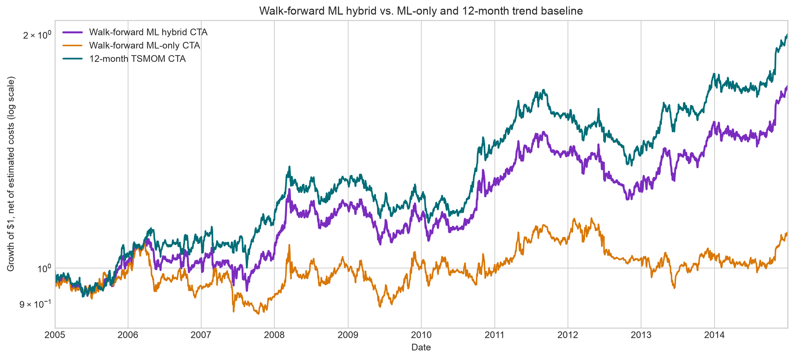

# Delta1 Trading Strategy

An auditable, cost-aware cross-asset futures research project built for a quantitative developer interview. It contains three related research tracks:

1. **12-month TSMOM CTA** — the deliberately simple, literature-backed baseline.
2. **Robust Adaptive TSMOM** — an institutional-style extension with market-specific volatility-shock sizing, a stateful no-trade buffer, invariant checks, and execution-cost stress tests.
3. **Walk-forward ML experiment** — a pooled monthly classifier with nested annual model selection, lagged public macro features, block-bootstrap uncertainty, and an explicitly documented negative result.

> **Important:** this repository does not claim to reproduce proprietary Jane Street, Optiver, Citadel, or other firms' strategies. Those firms' actual models, data, execution systems, and controls are private. The extension applies public quant-development principles—simple forecasts, strict timing, cost-aware execution, defensive risk controls, and aggressive testing—to the daily futures data available here. Daily bars cannot support a genuine market-making simulation because they contain no bid/ask quotes, order book, queue position, order flow, or fill data.




## Results

Net of a half-tick spread estimate plus USD 2.50 per contract per one-way trade, evaluated from 2005-01-03 through 2014-12-31:

| Strategy | CAGR | Volatility | Sharpe | Max drawdown | Annual cost drag |
|---|---:|---:|---:|---:|---:|
| Robust Adaptive TSMOM | 7.04% | 10.56% | 0.70 | -18.61% | 0.12% |
| 12-month TSMOM baseline | 6.93% | 10.69% | 0.68 | -20.19% | 0.14% |

The adaptive result remains positive with 3x the base trading-cost assumption: 6.79% CAGR and 0.67 Sharpe. See [`outputs/institutional_stress_tests.csv`](outputs/institutional_stress_tests.csv) for every scenario.

The ML study is deliberately reported without winner-shopping:

| Forecast | CAGR | Volatility | Sharpe | Max drawdown | OOS ROC AUC |
|---|---:|---:|---:|---:|---:|
| 12-month TSMOM | 6.93% | 10.69% | 0.68 | -20.19% | — |
| 50% ML / 50% trend | 5.36% | 10.80% | 0.54 | -18.22% | 0.491 |
| ML only | 1.03% | 10.49% | 0.15 | -19.19% | 0.491 |

The classifier does not add reliable directional alpha. Under Occam's razor, the simple 12-month trend remains the preferred forecast; the robust adaptive implementation remains the best overall implementation candidate. The ML code is retained as a reproducible falsification exercise, not marketed as an improvement.

These are historical backtest results, not expected returns. The supplied futures files end in 2014, and a continuous contract is not directly tradable.

## Strategy logic

At each month-end, the core forecast for contract `i` is:

```text
direction[i, t] = sign(close[i, t] - close[i, t - 252])
```

The adaptive layer then:

1. measures 20-day versus 120-day exponentially weighted price-change volatility;
2. gradually reduces instrument exposure when the fast/slow ratio exceeds 1.35;
3. retains at least 75% of the forecast in a full shock, avoiding a binary risk-off switch;
4. sizes contracts by lagged annualized dollar volatility;
5. gives each of four asset classes equal ex-ante risk;
6. scales portfolio risk toward 10% annualized volatility, capped at 2x;
7. suppresses month-end target changes inside a 25% no-trade band;
8. activates the resulting target on the next business day;
9. calculates P&L from price change × point value and deducts explicit costs.

The 3-month direction is retained as a diagnostic and optional confirmation overlay. It is disabled in the default strategy because the ablation test shows that aggressive confirmation weakened this sample. Rejecting an unnecessary feature is part of the research result.

## Why price changes, not percentage returns?

The `_CCB` files are additive back-adjusted continuous futures. Their synthetic price level can approach or cross zero. A percentage return on that level is not economically meaningful. Contract P&L is:

```text
contract_pnl[i, t] = contracts[i, t-1]
                   * (price[i, t] - price[i, t-1])
                   * point_value[i]
```

Using the catalogue's tick size and point value also makes transaction costs contract-specific and auditable.

## Universe

The selected contracts are liquid, USD-denominated futures, which avoids an unprovided historical FX conversion layer:

| Asset class | Contracts |
|---|---|
| Equity indices | ES, NQ, RTY, NKD |
| US government bonds | ZT, ZF, ZN, ZB |
| G10 FX | 6A, 6B, 6C, 6E, 6J, 6S |
| Commodities | CL, NG, GC, SI, HG, ZC, ZW, ZS |

## Repository map

| Path | Purpose |
|---|---|
| [`delta1_cta.py`](delta1_cta.py) | Baseline data loader, forecast, risk sizing, cost accounting, performance metrics, benchmarks, robustness grid, plots, and CLI. |
| [`institutional_strategy.py`](institutional_strategy.py) | Layered adaptive forecast, shock control, no-trade state machine, invariant checks, stress scenarios, comparison outputs, and CLI. |
| [`ml_strategy.py`](ml_strategy.py) | Point-in-time feature panel, nested annual model selection, probability/trend blend, diagnostics, bootstrap, and CLI. |
| [`download_external_data.py`](download_external_data.py) | Reproducible FRED downloader with timestamps, source URLs, and hashes. |
| [`data_engineer_features.py`](data_engineer_features.py) | DTCC/CFTC FX snapshot validation, audit, capped-notional parsing, and pair aggregation. |
| [`DELTA1_CTA_Strategy.ipynb`](DELTA1_CTA_Strategy.ipynb) | Executed case-submission notebook for the baseline and benchmark analysis. |
| [`INSTITUTIONAL_STRATEGY.ipynb`](INSTITUTIONAL_STRATEGY.ipynb) | Executed engineering notebook for the adaptive strategy, diagnostics, ablations, and failure modes. |
| [`ML_WALK_FORWARD_STRATEGY.ipynb`](ML_WALK_FORWARD_STRATEGY.ipynb) | Executed ML research notebook covering sources, timing, training, results, robustness, and rejected hypothesis. |
| [`test_delta1_cta.py`](test_delta1_cta.py) | Baseline unit and supplied-data integration tests. |
| [`test_institutional_strategy.py`](test_institutional_strategy.py) | Look-ahead, bounds, state-machine, cost, timing, and integration tests. |
| [`test_ml_strategy.py`](test_ml_strategy.py) | Macro lag, label cutoff, future-mutation, bounded-signal, DTCC exclusion, and data-integration tests. |
| [`docs/ARCHITECTURE.md`](docs/ARCHITECTURE.md) | Layer boundaries and data flow. |
| [`docs/STRATEGY.md`](docs/STRATEGY.md) | Mathematical specification and design decisions. |
| [`docs/VALIDATION.md`](docs/VALIDATION.md) | OOS convention, stress tests, invariants, and limitations. |
| [`docs/DATA_DICTIONARY.md`](docs/DATA_DICTIONARY.md) | Required input files, fields, units, and cleaning policy. |
| [`docs/ML_RESEARCH.md`](docs/ML_RESEARCH.md) | ML specification, annual selection protocol, findings, rejected shortcuts, and next valid test. |
| [`outputs/`](outputs) | Reproducible metrics, equity curves, checks, stress tables, and charts. |

## Quick start

Python 3.11+ is recommended.

```bash
git clone git@github.com:Manutd1234/Delta1_Trading_Strategy.git
cd Delta1_Trading_Strategy

python -m venv .venv
source .venv/bin/activate
pip install -r requirements.txt
```

Point `DELTA1_DATA_DIR` to the provided Delta1 directory containing the futures catalogue and `Futures Data/`:

```bash
export DELTA1_DATA_DIR="/path/to/Round1AllData/Quant Researcher/Delta1"
```

Run the baseline:

```bash
python delta1_cta.py \
  --data-dir "$DELTA1_DATA_DIR" \
  --output-dir outputs
```

Run the adaptive strategy and all stress tests:

```bash
python institutional_strategy.py \
  --data-dir "$DELTA1_DATA_DIR" \
  --output-dir outputs
```

Download the public macro inputs, audit the supplied Data Engineer snapshot, and run the ML experiment:

```bash
python download_external_data.py

export DELTA1_DATA_ENGINEER_INPUT="/path/to/Round1AllData/Data Engineer/CFTC_CUMULATIVE_FOREX_2024_04_08.csv"
python data_engineer_features.py \
  --input "$DELTA1_DATA_ENGINEER_INPUT" \
  --output-dir outputs

python ml_strategy.py \
  --data-dir "$DELTA1_DATA_DIR" \
  --external-macro data/external/fred_macro.csv \
  --output-dir outputs
```

The Data Engineer directory supplied for this case contains a single 2024 DTCC/CFTC cumulative FX snapshot plus its public-price-dissemination field guide. It does **not** contain a 2005–2014 Delta1 feature history. The snapshot is therefore audited and aggregated as live feature plumbing but is never injected into the historical fit.

Run all tests:

```bash
python -m unittest -v \
  test_delta1_cta.py test_institutional_strategy.py test_ml_strategy.py
```

Execute all notebooks:

```bash
jupyter nbconvert --to notebook --execute --inplace \
  DELTA1_CTA_Strategy.ipynb

jupyter nbconvert --to notebook --execute --inplace \
  INSTITUTIONAL_STRATEGY.ipynb

jupyter nbconvert --to notebook --execute --inplace \
  ML_WALK_FORWARD_STRATEGY.ipynb
```

## Python design

### `delta1_cta.py`

The baseline is organized as testable functions rather than a monolithic notebook:

- `load_metadata()` validates contract currency, tick size, and point value.
- `load_prices()` loads each `_CCB` close, de-duplicates dates, creates a common business-day calendar, and bridges only short exchange holidays.
- `trend_signal()` creates pre-declared time-series momentum forecasts.
- `_base_target_positions()` converts forecasts into class-balanced volatility-scaled contracts per dollar.
- `_held_positions()` enforces the one-business-day signal lag.
- `_gross_returns()` performs futures P&L accounting.
- `_portfolio_leverage()` implements lagged volatility targeting with hard bounds.
- `run_backtest()` applies trading costs and returns every intermediate object.
- `performance_metrics()` calculates CAGR, volatility, Sharpe, Sortino, drawdown, Calmar, hit rate, cost drag, and average leverage.
- `robustness_table()` tests horizon and cost assumptions without hiding weak variants.

### `institutional_strategy.py`

The extension keeps the forecast, risk, execution, and accounting layers separate:

- `build_institutional_forecast()` produces the core direction, optional confirmation, volatility ratio, and bounded shock multiplier.
- `apply_no_trade_buffer()` is a stateful execution policy; it keeps the prior target until the desired change clears an economically interpretable threshold.
- `run_institutional_backtest()` composes the layers with strict timing.
- `strategy_invariants()` exposes pass/fail controls instead of burying assertions.
- `stress_test_table()` perturbs costs, buffer width, shock control, and confirmation strength.
- `save_institutional_outputs()` writes portable artifacts and a headless chart.

Both CLIs are thin wrappers around reusable functions, so notebook analysis and tests call exactly the same production path.

### `ml_strategy.py`

The ML extension is intentionally small and reviewable:

- `load_external_macro()` aligns FRED data and lags it one business day.
- `build_feature_panel()` creates monthly instrument, cross-sectional, asset-class, and market features with next-month labels.
- `walk_forward_predict()` uses a 24-month trailing validation window to select among two ridge classifiers and two shallow boosted trees once per calendar year.
- `predictions_to_signal_matrix()` converts probabilities to bounded forecasts and combines them with the 12-month prior.
- `run_ml_pipeline()` reuses the exact baseline sizing, execution timing, cost, and P&L layers.
- block-bootstrap Sharpe ranges, blend/cost sensitivities, classification metrics, model selections, feature importance, and subperiod returns are all persisted under `outputs/`.

## Research lineage

- Moskowitz, Ooi & Pedersen, [“Time Series Momentum”](https://pages.stern.nyu.edu/~lpederse/papers/TimeSeriesMomentum.pdf), *Journal of Financial Economics* (2012).
- Hurst, Ooi & Pedersen, [“A Century of Evidence on Trend-Following Investing”](https://doi.org/10.3905/jpm.2017.44.1.015), *Journal of Portfolio Management* (2017).
- Moreira & Muir, [“Volatility-Managed Portfolios”](https://www.nber.org/papers/w22208), *Journal of Finance* (2017).
- Lim, Zohren & Roberts, [“Enhancing Time Series Momentum Strategies Using Deep Neural Networks”](https://arxiv.org/abs/1904.04912), *Journal of Financial Data Science* (2019).
- Gu, Kelly & Xiu, [“Empirical Asset Pricing via Machine Learning”](https://www.nber.org/papers/w25398), *Review of Financial Studies* (2020).
- Bailey et al., [“The Probability of Backtest Overfitting”](https://papers.ssrn.com/sol3/papers.cfm?abstract_id=2326253), *Journal of Computational Finance* (2017).

## Main limitations

- Data stop in 2014; post-2014 and live paper validation are required.
- Continuous back-adjusted tickers hide actual contract rolls and cannot be executed directly.
- The cost model omits market impact, queueing, exchange fees, and liquidity variation.
- Fractional contracts approximate a scalable institutional book; a small account requires integer optimization.
- Collateral yield, financing, broker margin, and taxes are omitted.
- Daily bars cannot model intraday market making or execution alpha.
- The current instrument catalogue may introduce survivorship bias.
- FRED downloads are reproducible and lagged, but revised history is not a substitute for vintage release data.
- The 2024 DTCC snapshot cannot support a historical feature backfill; a daily point-in-time archive is required.
- The monthly 22-instrument panel is too small and dependent to justify a high-capacity deep-learning model.

See [`docs/VALIDATION.md`](docs/VALIDATION.md) for the full audit and next-step plan.

## License

MIT. Historical research only; not investment advice.
